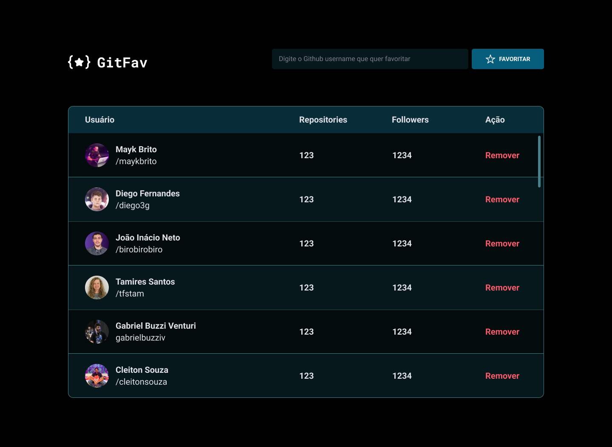

<h1 align="center"> GitFav </h1>

Projeto desenvolvido durante o curso Full Stack da Rocketseat.  

  <a href="#-tecnologias">Tecnologias</a>&nbsp;&nbsp;&nbsp;|&nbsp;&nbsp;&nbsp;
  <a href="#-projeto">Projeto</a>&nbsp;&nbsp;&nbsp;|&nbsp;&nbsp;&nbsp;
  <a href="#memo-licença">Licença</a>

  

 

  

## 🚀 Tecnologias

Esse projeto foi desenvolvido com as seguintes tecnologias:

- HTML e CSS
- Javascript
- Git e Github

## 💻 Projeto

O projeto "GitFav" é um projeto para praticar API e OO onde a funcionalidade é salvar meus usuários do git favoritos.

- [Acesse o projeto finalizado, online](https://rouxltda.github.io/explorer-gitfav)

## :memo: Licença

Esse projeto está sob a licença MIT.

---

Feito com ♥ by Ayres Roux.
